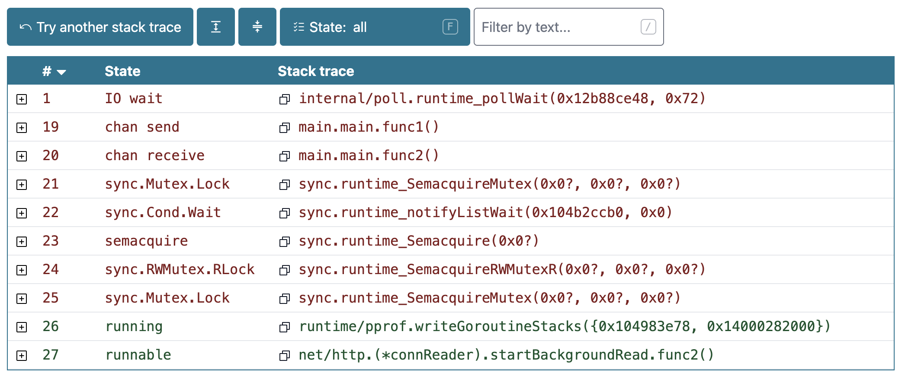

# goscope.net


A small set of tools to expore state of Golang programs.

This application is a small frontend-only web application written with Vue and Nuxt.

## Links

- [**goscope.net**](https://goscope.net) (built from [GitHub releases](https://github.com/kapitanov/goscope.net/releases))
- [**staging.goscope.net**](https://staging.goscope.net) (built from `master` branch)

## Motivation

Golang offers a lot of tools to explore the state of the running program.
However, some of them are missing the user-friendly interface.
Surprisingly, even powerful Golang IDEs (like VSCode or JetBrains Goland) are lacking these tools too.

I've bumped into this issue for a number of times
and decided to create a small web application that will help me to explore the state of the my Golang programs.

Hope this app would be useful for other Gophers as well.

## Features

**GoScope** has the following features:

- Explore Goroutines stack traces dump.

  

  This feature lets you take a deep look at the output of `/debug/pprof/goroutine?debug=2` endpoint of your Golang application.

- Explore Benchmark results.

  

  This feature lets you take a pretty look at the output of your Go benchmarks.

## How to build and run

### Build

```bash
make build
```

The output (static files) will be in the `dist` directory.

### Run tests

```bash
make test
```

### Run linter

```bash
make lint
```

### Run development server

```bash
make dev
```

### Run preview server

```bash
make preview
```

### Run autofomatter

```bash
make format
```

### Deploy to Cloudflare

```bash
make deploy
```

Before running the deploy command, make sure to set the following environment variables:

- `CLOUDFLARE_ACCOUNT_ID`
- `CLOUDFLARE_PROJECT_NAME`
- `CLOUDFLARE_API_TOKEN`

It's required to run `make build` before running `make deploy`.

Also, it's recommended to set the following environment variables:

- `GOOGLE_ANALYTICS_TOKEN` - this variable should be set before running `make build` to include Google Analytics tracking code in the build.

## Feature flags

Feature flags are defines as environment variables.

| Environment variable           | Feature                    |
| ------------------------------ | -------------------------- |
| `FEATURE_GOROUTINES`           | Enable "Goroutines viewer" |
| `FEATURE_BENCHMARK_VISUALIZER` | Enable "Benchmark viewer"  |

The value of an environment variable is not relevant: any non-empty value will be treated as "enabled".
If no feature flags environment variables are set, the applciation will treat all flags as enabled.

## Contributions

Community contributions are welcome via [Pull Requests](https://github.com/kapitanov/goscope.net/pulls) on GitHub.
Code submitted via Pull Requests should match the general style of the code in the repo.

## License

The source code of this project is licensed under [the MIT license](LICENSE).
